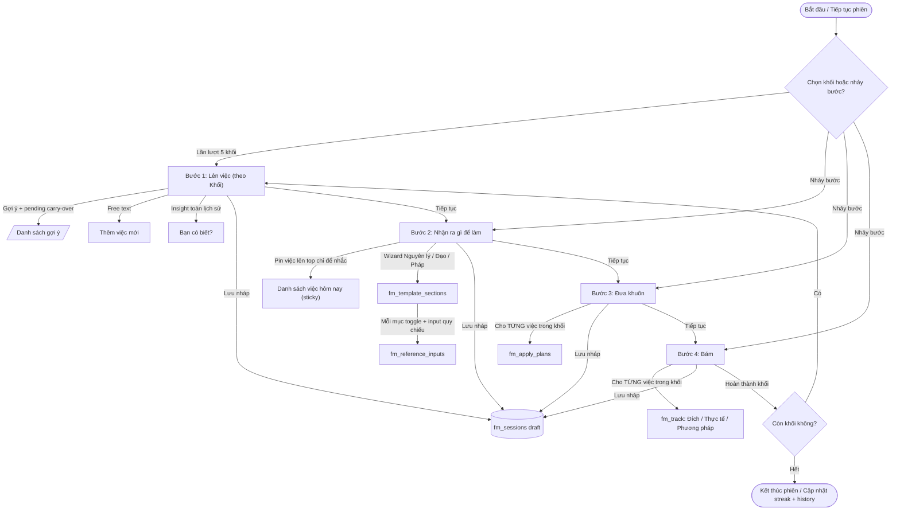

# PRD — Framework Method

Tài liệu mô tả sản phẩm (PRD) cho app `framework-method` trong Superapp monorepo. Bản này khóa flow 4 bước mới (Khối → Nhận ra → Đưa khuôn → Bám) và 6 quyết định đã chốt. Giai đoạn này **chỉ cập nhật tài liệu, chưa code**.

---

## 1. Tổng quan

### 1.1. Mục tiêu
Framework Method giúp user chạy phương pháp tư duy 4 bước trên 5 khối cuộc sống mỗi ngày, đồng thời cho phép Author tự xây dựng khuôn/template qua Web Builder.

### 1.2. Ngữ cảnh
- Nằm trong `apps/framework-method/` của monorepo `vietnguyenduc/superapp-monorepo`.
- React 18 + Vite + TypeScript + Tailwind CSS, dùng chung Supabase qua `@superapp/iam` + `@superapp/shared-utils`.
- Mobile-first, dark mode, i18n `vi/en`.
- Deploy Vercel với custom domain `framework-method.appforyou.xyz`.
- Auth: email/password thông qua Superapp SSO, `company_id` RLS nếu cần chia tenant.
- Port dev: **5179**.

### 1.3. Đối tượng
- **End user** chạy phiên làm việc hàng ngày.
- **Author / Builder** tạo/sửa khuôn cho bản thân hoặc công ty qua màn Builder.

---

## 2. Mô hình khái niệm (Concept Model)

### 2.1. Khối (Block / Life Domain)
5 khối cố định:

| STT | Khối | Ví dụ việc |
|-----|------|------------|
| 1 | Bản thân | Quét nhà, rửa chén, kính lễ |
| 2 | Quan hệ | Gọi điện cho bạn bè, hẹn gặp đối tác |
| 3 | Công việc | Lên kế hoạch sprint, viết tài liệu |
| 4 | Tài chính | Theo dõi ngân sách, đầu tư, tiết kiệm |
| 5 | Gia đình | Nấu ăn, đưa đón con, dọn dẹp |

Mỗi khối có **bộ template riêng** cho Bước 2 (Nhận ra), Bước 3 (Đưa khuôn), Bước 4 (Bám). Các việc trong ngày (`daily task`) gắn với một khối.

### 2.2. Việc trong ngày (Daily Task)
- User tự khai báo theo từng khối.
- Có thể chọn từ gợi ý hoặc nhập free text.
- Editable sau này (sửa/xóa/thêm bất kỳ lúc nào).
- Trạng thái: `pending` | `done`.

### 2.3. 4 bước của một phiên (Session)

1. **Bước 1 — Lên việc theo Khối**: khai báo việc cho từng khối + insight.
2. **Bước 2 — Nhận ra gì để làm**: Wizard Nguyên lý → Đạo → Pháp, dùng danh sách việc làm nhắc nhở.
3. **Bước 3 — Đưa khuôn**: lập kế hoạch cụ thể **cho từng việc**.
4. **Bước 4 — Bám**: ghi **Đích / Thực tế / Phương pháp** cho từng việc.

Tất cả nội dung + thứ tự của các bước 2–4 do **Builder** cấu hình theo từng khối.

---

## 3. Sáu quyết định đã chốt

| # | Quyết định | Ảnh hưởng |
|---|------------|-----------|
| (1) | Insight **"Bạn có biết?"** ở Bước 1 tính theo **toàn bộ lịch sử** của khối, không giới hạn khoảng thời gian. | Cần bảng/aggregate `fm_block_stats` hoặc materialized view theo `(user_id, block_id)`. |
| (2) | Việc chưa xong ("cần thực hành lại") **tự động carry-over** sang gợi ý ngày hôm sau. | `fm_daily_tasks.status = pending` của ngày trước sẽ được query và đưa vào danh sách gợi ý. |
| (3) | Việc pin lên top ở Bước 2 **chỉ hiển thị nhắc nhở**, không map task ↔ nguyên lý/đạo/pháp. | UI hiển thị danh sách việc sticky ở đầu màn wizard, không ràng buộc quy chiếu. |
| (4) | Bước 3 (Đưa khuôn) và Bước 4 (Bám) thực hiện **cho từng việc trong khối**, không cho cả khối. | `fm_apply_plans` và `fm_track` có FK đến `fm_daily_tasks.id`, 1-1 với mỗi việc. |
| (5) | Số lượng 8 nguyên lý / 7 Đạo / 18 ý pháp là **mặc định gợi ý**, nhưng Author thêm/bớt tùy ý trong Builder. | `fm_template_sections` lưu danh sách items dạng JSON/mảng, không hardcode số lượng. |
| (6) | Flow 4 bước **KHÔNG bắt buộc tuần tự**: user có thể nhảy bước và **lưu nháp** giữa chừng. | `fm_sessions` lưu `current_step`, `draft_payload`, `status` (draft / in_progress / completed). |

---

## 4. Flow tổng thể



### 4.1. Ghi chú về non-linear flow
- User có thể nhấn "Lưu nháp" ở bất kỳ bước nào; hệ thống ghi lại `current_step` + payload tạm vào `fm_sessions`.
- User có thể nhảy từ Bước 1 sang Bước 3 hoặc Bước 4, nhưng dữ liệu thiếu sẽ được đánh dấu là `incomplete` và có thể bổ sung sau.
- Carry-over xảy ra khi mở Bước 1 ngày mới: query `fm_daily_tasks` có `status = 'pending'` của ngày trước gần nhất cho cùng `block_id`.

---

## 5. Đặc tả từng bước

### 5.1. Bước 1 — Lên việc theo từng Khối

#### 5.1.1. Vòng lặp qua khối
- Mỗi màn hình tương ứng với **một khối** user đã chọn.
- Tiêu đề: *"Hôm nay bạn sẽ làm gì trong Khối {Tên khối}?"*

#### 5.1.2. Gợi ý việc (chips/checklist)
- Nguồn: `fm_task_suggestions` (theo `block_id`) + `fm_daily_tasks` `pending` từ ngày trước (carry-over).
- User tick để thêm nhanh vào danh sách việc hôm nay.

#### 5.1.3. Free text
- Ô nhập mỗi dòng = 1 việc.
- Khi submit, tạo `fm_daily_tasks` với `source = 'freetext'`, `status = 'pending'`, `date = CURRENT_DATE`.

#### 5.1.4. Insight "Bạn có biết?"
- Hiển thị 3 con số theo **toàn lịch sử** của khối:
  - Số việc đã từng thực hiện (done).
  - Số "khuôn" (template/plan) đã áp dụng (`fm_apply_plans` / `fm_track` có dữ liệu).
  - Số việc chưa hoàn thành cần thực hành lại (carry-over count).
- Dữ liệu đọc từ `fm_block_stats` hoặc view aggregate để tránh quét toàn bảng.

#### 5.1.5. Chuyển bước
- Nút *"Tiếp tục"* → chuyển sang khối kế tiếp; hết 5 khối → sang Bước 2.
- Nút *"Lưu nháp"* → lưu `fm_sessions` với `status = 'draft'` và `current_step = 1`.

---

### 5.2. Bước 2 — Nhận ra gì để làm (Wizard khai thác)

#### 5.2.1. Pin danh sách việc
- Danh sách việc trong ngày (từ Bước 1) được pin cố định lên top cả màn hình, chỉ để **nhắc nhở**.
- **Không** map việc ↔ nguyên lý/đạo/pháp; user tự quy chiếu.

#### 5.2.2. Wizard Nguyên lý → Đạo → Pháp
- 3 màn hình con, mỗi màn hiển thị một nhóm section theo thứ tự Builder định nghĩa:
  1. **Nguyên lý cuộc đời** (mặc định gợi ý 8 mục).
  2. **Đạo** (mặc định gợi ý 7 mục).
  3. **Pháp** (mặc định gợi ý 18 ý pháp).
- Mỗi mục là một khối kiến thức:
  - Toggle mở/đóng.
  - Checkbox bật/tắt mục (`is_enabled`).
  - Input quy chiếu tự do (không bắt buộc điền hết).
- Nội dung, thứ tự, số lượng mục do Builder cấu hình theo từng khối.

#### 5.2.3. Lưu quy chiếu
- Mỗi input quy chiếu lưu vào `fm_reference_inputs` với `session_id` và `section_id`.
- Có thể *"Lưu nháp"* bất kỳ lúc nào.

---

### 5.3. Bước 3 — Đưa khuôn (lập kế hoạch cụ thể)

#### 5.3.1. Thực hiện cho từng việc
- User chọn/xem từng việc trong khối.
- Mỗi khối có template `step_type = 'apply'` trong `fm_templates`.
- Template render các `fm_template_sections` thuộc nhóm `dua_khuon`.

#### 5.3.2. Dữ liệu kế hoạch
- Kết quả lưu vào `fm_apply_plans` với `daily_task_id` (FK đến `fm_daily_tasks.id`) + `session_id`.
- Một việc có đúng **một** apply plan.

#### 5.3.3. Chuyển bước
- Sau khi hoàn thành tất cả việc trong khối (hoặc user chủ động next), chuyển sang Bước 4.
- Hỗ trợ *"Lưu nháp"*.

---

### 5.4. Bước 4 — Bám

#### 5.4.1. Thực hiện cho từng việc
- Tương tự Bước 3, nhưng template `step_type = 'track'`.
- Có 3 phần theo thứ tự:
  1. **Đích** — mục tiêu muốn đạt.
  2. **Thực tế** — hiện trạng thực tế.
  3. **Phương pháp** — cách thu hẹp khoảng cách Đích ↔ Thực tế.

#### 5.4.2. Dữ liệu theo dõi
- Lưu vào `fm_track` với `daily_task_id` + `session_id`, một bộ track cho mỗi việc.

#### 5.4.3. Kết thúc phiên
- Sau khi hoàn thành tất cả việc (hoặc user chủ động kết thúc), cập nhật `fm_sessions.status = 'completed'`.
- Cập nhật `fm_streaks` (current_streak, longest_streak, last_active_date).
- Ghi `History`.

---

## 6. Mô hình dữ liệu (`fm_*`)

### 6.1. Ghi chú về `fm_blocks`
Migration cũ đã dùng tên `fm_blocks` cho nội dung template. Khi refactor, bảng nội dung template sẽ được **rename** thành `fm_template_blocks` (hoặc merge vào `fm_template_sections`) để `fm_blocks` đại diện cho **5 Khối cuộc sống** theo PRD này.

### 6.2. Bảng khối / việc / gợi ý

#### `fm_blocks` — 5 Khối cuộc sống
| Cột | Kiểu | Mô tả |
|-----|------|-------|
| `id` | uuid / text | Khóa chính. 5 dòng cố định: `self`, `relationship`, `work`, `finance`, `family`. |
| `name_vi` | text | Tên tiếng Việt. |
| `name_en` | text | Tên tiếng Anh. |
| `order_index` | int | Thứ tự hiển thị. |
| `created_at` | timestamptz | — |

#### `fm_task_suggestions` — Gợi ý việc theo khối
| Cột | Kiểu | Mô tả |
|-----|------|-------|
| `id` | uuid | PK. |
| `block_id` | uuid | FK `fm_blocks.id`. |
| `title_vi` | text | Gợi ý tiếng Việt. |
| `title_en` | text | Gợi ý tiếng Anh. |
| `is_default` | bool | Có hiện cho user mới không. |
| `created_by` | uuid | NULL nếu là system default. |
| `company_id` | uuid | NULL cho public, hoặc tenant. |

#### `fm_daily_tasks` — Việc trong ngày
| Cột | Kiểu | Mô tả |
|-----|------|-------|
| `id` | uuid | PK. |
| `user_id` | uuid | FK `auth.users.id`. |
| `block_id` | uuid | FK `fm_blocks.id`. |
| `session_id` | uuid | FK `fm_sessions.id`, nullable. |
| `date` | date | Ngày tạo/carry-over. |
| `title` | text | Nội dung việc. |
| `source` | text | `suggestion` \| `freetext` \| `carry_over`. |
| `status` | text | `pending` \| `done`. |
| `created_at` | timestamptz | — |
| `updated_at` | timestamptz | — |

**Carry-over**: khi mở Bước 1 ngày mới, query `fm_daily_tasks` có `status = 'pending'` và `date < CURRENT_DATE`, `user_id = auth.uid()`, group theo `block_id`, đưa vào đầu danh sách gợi ý. Khi user chọn/tick, tạo bản ghi mới với `source = 'carry_over'` và `date = CURRENT_DATE`.

#### `fm_block_stats` — Aggregate phục vụ insight toàn lịch sử
| Cột | Kiểu | Mô tả |
|-----|------|-------|
| `id` | uuid | PK. |
| `user_id` | uuid | — |
| `block_id` | uuid | — |
| `total_done` | int | Tổng việc đã hoàn thành (toàn lịch sử). |
| `total_applied` | int | Số việc đã có `fm_apply_plans`. |
| `total_tracked` | int | Số việc đã có `fm_track`. |
| `pending_carryover` | int | Số việc pending còn tồn đọng. |
| `updated_at` | timestamptz | — |

*Cập nhật*: trigger trên `fm_daily_tasks`, `fm_apply_plans`, `fm_track` (hoặc background job) cập nhật aggregate này. Đảm bảo Bước 1 không quét toàn bảng mỗi lần mở.

---

### 6.3. Bảng template / builder

#### `fm_templates` — Template cho từng khối và từng bước
| Cột | Kiểu | Mô tả |
|-----|------|-------|
| `id` | uuid | PK. |
| `block_id` | uuid | FK `fm_blocks.id`. NULL nếu là template chung. |
| `step_type` | text | `recognize` \| `apply` \| `track`. |
| `name` | text | Tên template. |
| `status` | text | `draft` \| `published`. |
| `created_by` | uuid | — |
| `company_id` | uuid | NULL cho public. |
| `created_at` | timestamptz | — |
| `updated_at` | timestamptz | — |

#### `fm_template_sections` — Các section trong Builder
| Cột | Kiểu | Mô tả |
|-----|------|-------|
| `id` | uuid | PK. |
| `template_id` | uuid | FK `fm_templates.id`. |
| `group` | text | `nguyen_ly` \| `dao` \| `phap` \| `dua_khuon` \| `bam`. |
| `title_vi` | text | Tiêu đề section. |
| `title_en` | text | — |
| `is_toggle` | bool | Có phải section dạng toggle không. |
| `is_enabled` | bool | Mặc định bật/tắt. |
| `order_index` | int | Thứ tự kéo thả. |
| `items` | jsonb | Mảng các mục con: `[{id, title_vi, title_en, default_enabled, order_index}]`. |
| `created_at` | timestamptz | — |
| `updated_at` | timestamptz | — |

- Số lượng items trong `items` **không cố định**; Author có thể thêm/bớt trong Builder.
- `group` quy định section thuộc wizard nào:
  - `nguyen_ly`, `dao`, `phap` → Bước 2.
  - `dua_khuon` → Bước 3.
  - `bam` → Bước 4.

---

### 6.4. Bảng phiên làm việc / dữ liệu nhập

#### `fm_sessions` — Trạng thái phiên
| Cột | Kiểu | Mô tả |
|-----|------|-------|
| `id` | uuid | PK. |
| `user_id` | uuid | — |
| `date` | date | Ngày tạo phiên. |
| `status` | text | `draft` \| `in_progress` \| `completed`. |
| `current_step` | int | 1 \| 2 \| 3 \| 4. |
| `current_block_id` | uuid | Khối đang làm dở (nếu có). |
| `draft_payload` | jsonb | Dữ liệu tạm chưa commit. |
| `started_at` | timestamptz | — |
| `ended_at` | timestamptz | — |
| `created_at` | timestamptz | — |
| `updated_at` | timestamptz | — |

`draft_payload` có dạng:
```json
{
  "step1": { "self": [...], "work": [...] },
  "step2": { "reference_inputs": [...] },
  "step3": { "apply_plans": { "task_id": {...} } },
  "step4": { "tracks": { "task_id": {...} } }
}
```

#### `fm_reference_inputs` — Quy chiếu ở Bước 2
| Cột | Kiểu | Mô tả |
|-----|------|-------|
| `id` | uuid | PK. |
| `session_id` | uuid | FK `fm_sessions.id`. |
| `section_id` | uuid | FK `fm_template_sections.id`. |
| `item_id` | text | ID mục trong `fm_template_sections.items`. |
| `content` | text | Nội dung user nhập. |
| `is_enabled` | bool | Mục có được bật không. |
| `created_at` | timestamptz | — |
| `updated_at` | timestamptz | — |

---

### 6.5. Bảng kế hoạch và theo dõi

#### `fm_apply_plans` — Đưa khuôn, 1-1 với mỗi việc
| Cột | Kiểu | Mô tả |
|-----|------|-------|
| `id` | uuid | PK. |
| `daily_task_id` | uuid | FK `fm_daily_tasks.id`, unique. |
| `session_id` | uuid | FK `fm_sessions.id`. |
| `plan_data` | jsonb | Dữ liệu template `dua_khuon` đã điền. |
| `created_at` | timestamptz | — |
| `updated_at` | timestamptz | — |

#### `fm_track` — Bám, 1-1 với mỗi việc
| Cột | Kiểu | Mô tả |
|-----|------|-------|
| `id` | uuid | PK. |
| `daily_task_id` | uuid | FK `fm_daily_tasks.id`, unique. |
| `session_id` | uuid | FK `fm_sessions.id`. |
| `dich` | text | Mục tiêu. |
| `thuc_te` | text | Hiện trạng. |
| `phuong_phap` | text | Cách thu hẹp khoảng cách. |
| `created_at` | timestamptz | — |
| `updated_at` | timestamptz | — |

#### `fm_streaks` — Chuỗi ngày thực hành
| Cột | Kiểu | Mô tả |
|-----|------|-------|
| `id` | uuid | PK. |
| `user_id` | uuid | — |
| `current_streak` | int | — |
| `longest_streak` | int | — |
| `last_active_date` | date | — |

---

### 6.6. Bảng hỗ trợ (hiện có / bổ sung)

| Bảng | Mục đích |
|------|----------|
| `fm_profiles` | Thông tin user (full_name, avatar, company_id). |
| `fm_actions` | Committed actions (màn Actions). |
| `fm_reflections` | Midday / evening / step reflections. |
| `fm_daily_goals` | Daily goal categories (màn Evening / Dashboard). |
| `fm_sessions` | Quản lý phiên + draft. |
| `fm_streaks` | Chuỗi ngày. |

### 6.7. RLS và quyền truy cập
- Bật RLS trên **tất cả bảng**.
- Mọi bảng user-scoped lọc theo `auth.uid() = user_id`.
- `fm_templates`, `fm_template_sections`, `fm_blocks`, `fm_task_suggestions` có `status = 'published'` thì đọc công khai (authenticated users).
- `fm_blocks` 5 khối là public seed, đọc cho mọi user đã đăng nhập.

---

## 7. Builder (Web Template Builder)

### 7.1. Mục tiêu
Cho Author tạo/sửa template cho từng khối và từng bước (`recognize`, `apply`, `track`) mà **không cần code**.

### 7.2. Cấu trúc kéo thả
- Tái dùng pattern `react-beautiful-dnd` (`DragDropContext` / `Droppable` / `Draggable`) đã có trong `apps/sales-operation` và `apps/inventory-operation`.
- Mỗi `template` là một canvas.
- Mỗi `section` là một card kéo thả được:
  - Sửa title `vi/en`.
  - Bật/tắt toggle (`is_toggle`).
  - Bật/tắt mặc định (`is_enabled`).
  - Đổi thứ tự qua `order_index`.
  - Thêm/bớt item trong `items` (chỉ áp dụng với `nguyen_ly`, `dao`, `phap`).

### 7.3. Các nhóm section
| `group` | Dùng ở bước | Ghi chú |
|---------|-------------|---------|
| `nguyen_ly` | Bước 2 | 8 mục mặc định, Author thêm/bớt. |
| `dao` | Bước 2 | 7 mục mặc định, Author thêm/bớt. |
| `phap` | Bước 2 | 18 ý pháp mặc định, Author thêm/bớt. |
| `dua_khuon` | Bước 3 | Form kế hoạch theo từng việc. |
| `bam` | Bước 4 | 3 trường Đích / Thực tế / Phương pháp. |

### 7.4. Trạng thái template
- `draft`: chỉ Author thấy.
- `published`: user trong cùng company / public thấy khi chạy phiên.
- Mỗi khối có thể có nhiều template, nhưng hệ thống ưu tiên `published` mới nhất.

---

## 8. Màn hình phụ trợ

### 8.1. Morning Dashboard
- Hiển thị streak (`fm_streaks`), tuần hoàn thành, insight nhanh, các framework/template active.
- Nút bắt đầu phiên mới / tiếp tục draft.

### 8.2. Calendar
- Xem tháng/tuần, hiển thị các ngày đã hoàn thành phiên.
- Lịch sử các phiên `completed`.

### 8.3. History
- Danh sách phiên đã hoàn thành kèm block đã làm, tóm tắt việc, kế hoạch, track.

### 8.4. Actions
- Committed actions (như todo list) chạy song song với phiên.
- Midday reflection + quick notes.

### 8.5. Evening
- What went well, daily goals progress, tomorrow's focus, close the day.
- Cập nhật `fm_streaks` nếu chưa được cập nhật.

---

## 9. Kiến trúc kỹ thuật

### 9.1. Frontend
- React 18 + Vite 8 + TypeScript strict.
- Tailwind CSS, `darkMode: 'class'`, design token Apple HIG.
- `react-router-dom` cho routing.
- `react-beautiful-dnd` cho Builder.
- i18next với `vi`/`en`.
- Recharts cho insight chart trên Dashboard.

### 9.2. Auth & Tenant
- `@superapp/iam`: `AuthProvider`, `CompanyProvider`, `useAuth`, `useCompany`.
- `@superapp/shared-utils`: `createSupabaseClient`.
- Shared Supabase project `peslmsctejkwzyohke`.
- Email/password auth; cross-app SSO qua `access_token` / `refresh_token` trong URL.
- RLS `user_id = auth.uid()`; `company_id` tenant nếu cần.

### 9.3. Backend / DB
- Supabase PostgreSQL + RLS.
- Triggers cập nhật `fm_block_stats` khi `fm_daily_tasks` / `fm_apply_plans` / `fm_track` thay đổi.
- Không xây dựng API server riêng cho app này; dùng Supabase client trực tiếp.

### 9.4. Deploy
- Vercel, root directory `apps/framework-method`.
- Custom domain `framework-method.appforyou.xyz`.
- `vercel.json` hiện có, không thay đổi port.

---

## 10. Non-functional Requirements

### 10.1. Performance
- Mở Bước 1 < 1.5s trên 3G.
- Insight "Bạn có biết?" đọc từ `fm_block_stats`, không quét `fm_daily_tasks` toàn bộ.
- Builder kéo thả mượt với ~50 sections.

### 10.2. Accessibility
- Form labels rõ ràng, keyboard navigation đầy đủ.
- Toggle có `aria-pressed`, accordion có `aria-expanded`.

### 10.3. Offline / Resilience
- Khi mất kết nối, lưu draft vào `localStorage` và đồng bộ lại Supabase khi online.
- Thông báo nhẹ nhàng, không block flow.

### 10.4. Security
- Không lưu secret (Supabase anon key) trong repo; dùng `.env` / Vercel env.
- Validate `user_id` ở cả client và RLS.

---

## 11. Lộ trình thực hiện (đề xuất)

1. **Sprint 0 — Schema refactor**: rename bảng cũ `fm_blocks` nội dung template, tạo `fm_blocks` khối + `fm_daily_tasks` + `fm_block_stats` + `fm_task_suggestions`.
2. **Sprint 1 — Bước 1 + Bước 2**: chạy flow Lên việc + Nhận ra, kèm carry-over và insight toàn lịch sử.
3. **Sprint 2 — Bước 3 + Bước 4**: Đưa khuôn/Bám theo từng việc, lưu draft.
4. **Sprint 3 — Builder**: kéo thả section, thêm/bớt items, publish template.
5. **Sprint 4 — Dashboard / Calendar / History / Actions / Evening**: hoàn thiện màn phụ trợ.
6. **Sprint 5 — Polish**: i18n, dark mode, responsive, test, deploy.

---

## 12. Quyết định nền đã chốt (giữ nguyên)

- App nằm trong monorepo Superapp, dùng shared auth + Supabase.
- Auth email/password; SSO cross-app qua token trong URL.
- Deploy Vercel + custom domain `framework-method.appforyou.xyz`.
- Dark mode + i18n `vi/en`.
- Mobile-first.
- Giữ các màn hình phụ: Morning Dashboard, Calendar, History, Actions, Evening.

---

## 13. Tài liệu liên quan

- `apps/framework-method/docs/OVERVIEW.md`
- `apps/framework-method/docs/AI-CONTEXT.md`
- `apps/framework-method/docs/CHANGELOG.md`
- `apps/framework-method/README.md`
- `supabase/migrations/20260527000004_framework_method_schema.sql`
- Apple HIG UI/UX guide: `apps/cashflow/docs/APPLE-HIG-UIUX-GUIDE.md` và `.agents/skills/apple-design-guidelines/SKILL.md`
